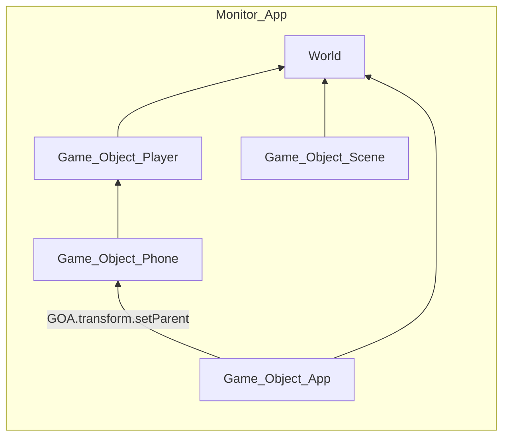
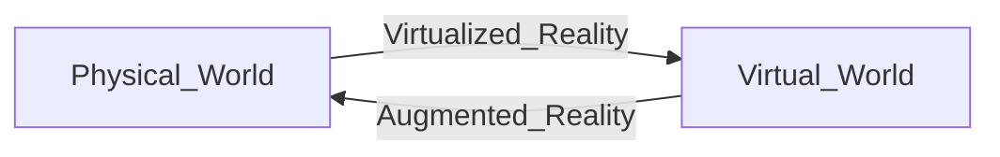
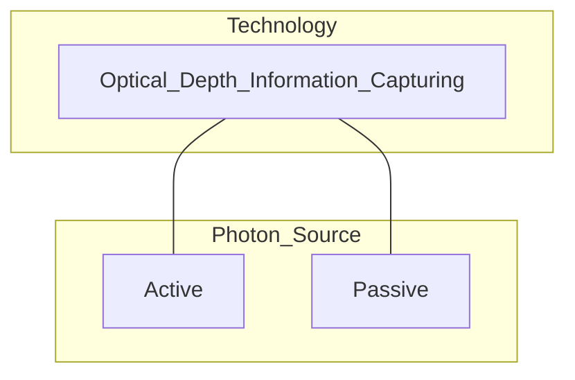

# Advanced 3DUI
## Scene Graphs

- also see [[2_Coordinate Systems#Scene Graphs|Augmented Reality Theory Scene Graphs]]
- simple hierachy defined by relations between objects

## Virtualized Reality

→ constructing virtual worlds from real scenes
→ asset creation for virtual enviroments
→ remote inspection
→ training
### Asset Creation
1. Scanning existing Objects
2. Creating from Scratch

## Optical Scanning Techniques

### Active
- light source as active photon source that is then measured and used for calculation
1. SL - Structured Light calculation between projector and camera (Kinect 1st Gen)
2. iTOF - modulated time of Flight (Kinect newer Gens)
3. dTOF - direct Time of Flight (LIDAR Iphone)

### Passive
- passive photon source → so light reflecting for photography
1. Photogrammetry - Multi View pictures get added together to 3D Model from many poses
2. Light-Field-based
3. Depths from Focus
