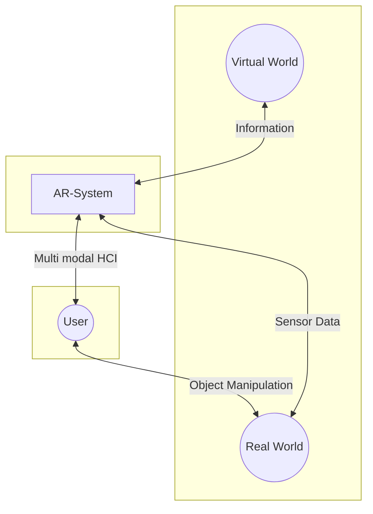

# Table of Contents
 [[1_Basic Computer Vision]]
 [[2_Coordinate Systems]]
 [[3_Camera Calibration]]
 [[4_Markerless Optical Tracking and Feature Detection]]
 [[5_Trackers]]
 [[6_Sensor Fusion]]
 [[7_Displays]]
 [[8_Display Calibration]]
# Introduction to Augmented Reality 

## Definition
### Azuma 98
- Combination of Real + Virtual Space
- Interactive in real-time
- Registered in 3 Dimensions
### Mixed Reality Continuum (Milgram and Kishino 94)

Mixed Reality describes the field in which we interact with a given combination of Enviroments (virtual and real):

$\overbrace{Real\ Enviroment \leftarrow Augmented\ Reality\ (AR) \leftrightarrow Augmented\ Virtuality\ (AV) \rightarrow Virtual\ Enviroment}^{\large Mixed\ Reality\ (MR)}$

### Multimedia Combination of Reality and "Virtuality"

## Approaches

1. Head-based (Head-mounted Displays HMDs): Typically Goggles or VR-Glasses
2. Hand-based: Hand-held via Smartphone or Game-Console
3. Desktop-based: with fixed camera setup interacting with a "virtual desk"
4. Real Surfaces: Interacting with object recognition in camera
5. Multi-touch: Displays that allow multi-touch interaction
6. Hybrid and Tangible: Combination of Approaches

## Sensors

1. [[5_Trackers#Optical Sensors|Optical Sensors]]
2. [[5_Trackers#Inertial Sensing|Intertial Sensing]]
3. [[5_Trackers#Electro-Magnetic Field Sensing|Radio-based Sensors ?]]
4. [[5_Trackers#Devices for Time/Frequency Tracking|Acoustic Sensors]]
5. [[5_Trackers#Mechanical Trackers|Mechanical Sensors]]
6. [[5_Trackers#Outside-in vs. Inside-out|Outside-in vs. Inside-out]]
7. [[7_Displays#Human Factors|Sensor limitations vs. Human Limitations]]

