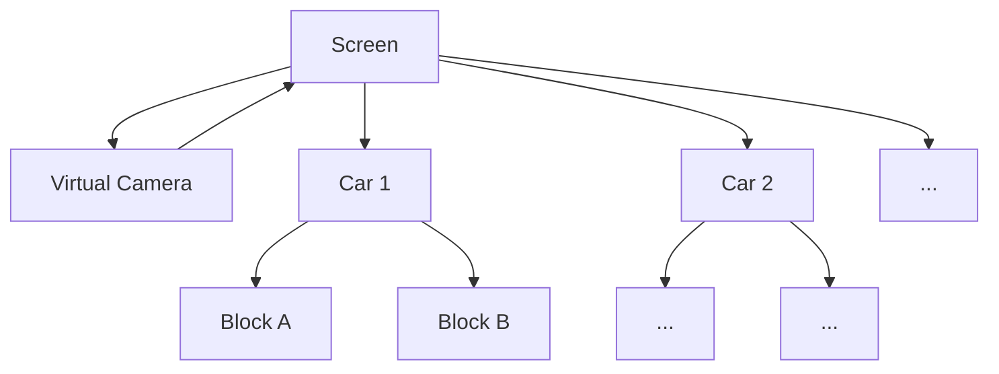
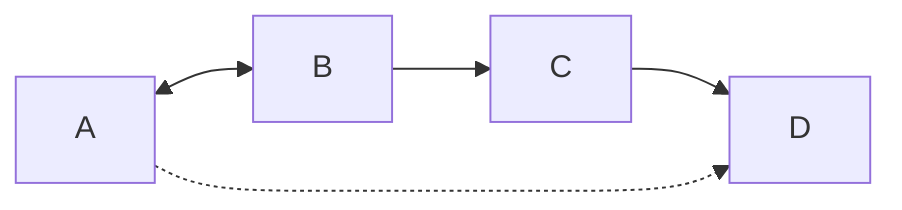
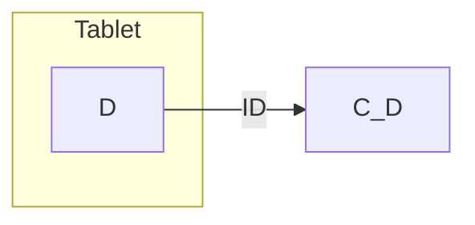
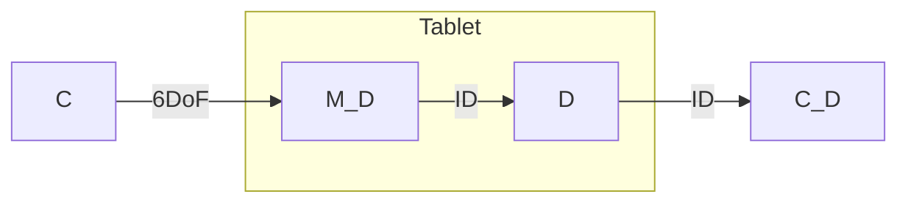
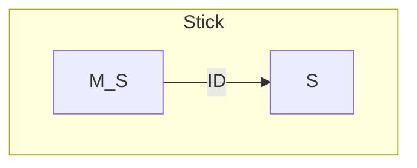
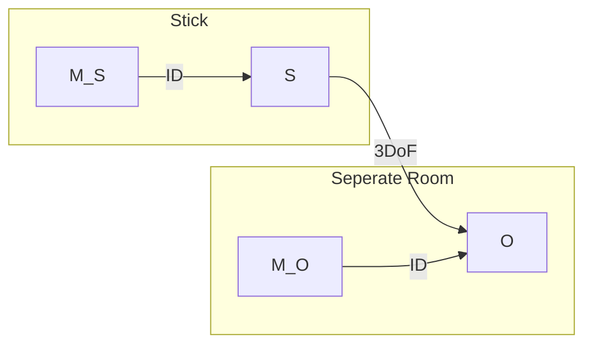
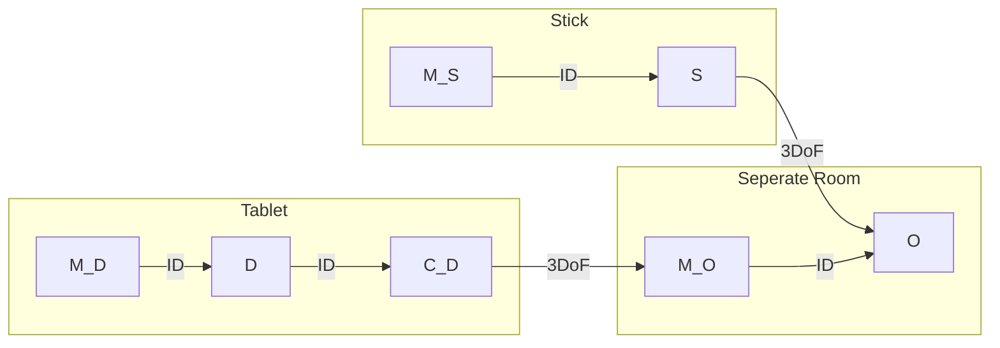
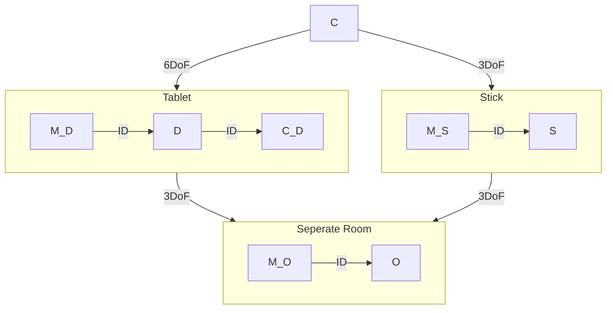

# Coordinate Systems

#SRG #Scene-Graph #homogenous-matrix-transformations #DoF
## Transformations

See in the Practical Chapter:
- [[1_Matrix-Vector Calculations#Matrix Vector Calculations|Vectors]]
- [[1_Matrix-Vector Calculations#Matrix-Matrix Multiplication|Matrices]]
- [[1_Matrix-Vector Calculations#Homogenous Matrices|Homogenous Matrix Operations]]

## Scene Graphs

### Motivation
World consists of:
 - **People (users):** hands, eyes, ...
 - **Objects:** Subparts, tracked Targets, ...
 - **Trackers**
We want to:
 - describe objects individually
 - replicate objects without having to redescribe geometric details
 - determine current pose of an object with respect to its relations

### Components
1. Nodes (Coordinate Systems):
   - Camera (eye)
   - Scene
   - Groups of Objects
   - Objects Parts
 2. Directed Edges (geometric transformations):
   - Changes in Pos, Rot, Scale, Perspective → relative to predecessor
   - In Graphics: typically a tree
   - in AR: a true Graph ([[2_Coordinate Systems#Spatial Relationship Graph (SRG)|Spacial Relationship Graph (SRG)]])
   
Example for a Scene Graph:

## Spatial Relationship Graph (SRG)

[Original Paper on SRGs in AR](https://campar.in.tum.de/pub/echtler2008split/echtler2008split.pdf)

| 3D World                     | SRG                          |
| ---------------------------- | ---------------------------- |
| Objects                      | Nodes                        |
| Things (physical or digital) | Coordinate systems ("pose")  |
| Users                        |                              |
| Sensors                      |                              |
|                              |                              |
| Spatial Relationships        | Edges                        |
| &nbsp;                       | Transformations              |
| Time-dependent relationships | Properties of edges          |
| static                       | registration                 |
| &nbsp;                       | calibration                  |
| dynamic                      | tracking                     |
|                              |                              |
| Operations                   | Properties of paths / cycles |
| Sensor Fusion                | Graph traversal              |

### Edge Attributes
- Edges are **directed**
- Translation with Degrees of Freedom (6 DoF, 3 DoF, ...)
- Transformation parameters
- Static Edges are solid while dynamic edges are dashed
- Estimation Method (direct → solid, derived → dashed)
	  → Transformations of coordinate System A to D is not known
	  → but there is a concatination of direct transformations
	  → we can derive the transformation and signify this with a dotted line
	  

### Example for SRG in Augmented Reality Scene

1. Tablet with Tracked Display $D_T$ connected to a camera $C_D$ which shows our final AR Scene of tracking in objects in a seperate room:

2. Tablet has a Marker $M_D$ that is tracked by an outside-in camera tracking system $C$:

3. We have one Control Stick $S$ (move and push: 3DoF) that is identified with a Marker $M_S$ and can move through our scene 

4. We have a object $O$ in a seperate room which is moved by $S$ and tracked via $M_O$

5. As stated in (1) our camera system tracks the objects in a seperate room

6. Lastly we add back the Outside-In camera $C$ Tracking System defined in (2) again tracking our Tablet Marker $M_D$ as well as our Stick Marker $M_S$ (cameras track the markers directly and Stick should be directly connected to Object but for readability they are pointing at the whole subgraphs)

→ So we Track our Tablet $M_D$ and our Stick $M_S$ with $C$ within the Room we are standing in so we can add augmentation
→ the Tablet shows the Object in the next room tracked via $C_D$ that can be moved using the Stick $S$
