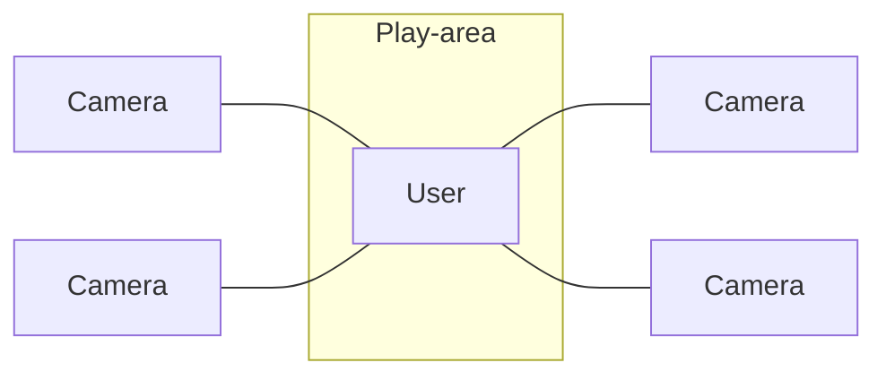
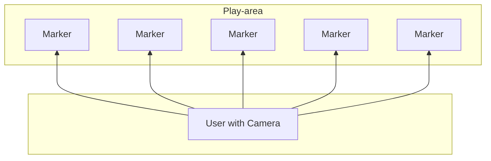

# Trackers

#tracker #sensor #outside-in #inside-out #HMD #detection #marker
## Placement Strategies for Trackers

### Sensors
Mobile → Wide Range and Dynamic Motion
Stationary → Precise but limited Range
### Targets
Mobile → Many, Cheap and Natural
Stationary → must be set up (effort)

### Devices for Time/Frequency Tracking
1. Ultrasound
   **Pro:** Small & Lightweight and independent of line-of sight
   **Con:** high variation due to enviromental factors and tethered
2. GPS
   **Pro:** Available world-wide, mobile
   **Con:** slow update rate, depends on line-of-sight with satellite and imprecise

## Optical Sensors
### Outside-in vs. Inside-out
#### Placement Strategies
Sensors / Targets | Mobile | Stationary
-- | -- | --
Mobile | Inside-In | Inside-Out
Stationary | Outside-In | Outside-Out
#### Outside-In
- Example: Stationary Sensor and Mobile Target (VR-HMD and fixed tracking Setup in Room)

→ Pro: Precise, Fast and Robust
→ Con: Small Range/ limited Area, Expensive, requires setup and line of sight
#### Inside-Out
- Example: Mobile Sensor and Stationary Target (Handheld Phone and AR-Marker)

| &nbsp; | Marker-based | "Marker-less" - (nat. Features) | [[4_Markerless Optical Tracking and Feature Detection#PTAM Approach - Parallel Tracking and Mapping\|SLAM / PTAM]] |
| ------ | ------------ | ----------- | ------------------------------------------------------------------------------------------------------------------ |
| Pro    | Cheap        | Unobtrusive | Very Flexible                                                                                                      |
|        | Fast         | Unnoticable | Unnotiable                                                                                                         |
|        | Precise      |             | Relaxed Line of Sight                                                                                              |
|        |              |             |                                                                                                                    |
| Con    | Ugly markers          | **Still** requires special markers | Untextured areas                                                                                                   |
|        | Line of sight ! | Line of sight !             | Slow                                                                                                   |
|        |                       |                                    | Might drift       

## Inertial Sensing

### Accelerometers
- measure acceleration through movement
- uses the inertia (resistance of matter to momentum) for measurement
### Gyroscopes
- object-stabilized axis of rotation
- can measure rotational forces relative to rotation axis
- but is disturbed by gravity or vibration

→ mobile
→ low latency
→ minimal setup
→ low precision
## Mechanical Trackers
- measure movement with mechanical arm
- mechanical arm has limited rotations
- movement can be measured at joints

→ high precision
→ limited range
→ restricts user movement
## Electro-Magnetic Field Sensing
1. create electro magnetic field in play area
2. measure changes in field from metals on your body

→ requires no user calibration
→ high precision
→ fast tracking
→ but limited area and restrictions on user (no metal)

## Hybrid Systems

Hybrid Systems in mobile applications should automatically connect
### Classification
Approaches in these Systems should use sensors with a high **difference**, specifically:
1. Complementary (different abilities → better data from more different tracking)
2. Competitive (strong approach → take the best of different options)
3. Cooperative (abilities complement each other → no system can work alone)
### Example - Nintendo Wii
- Accelerometers
- IR Camera + IR Light bar ([[5_Trackers#Inside-Out|inside-out]])
- Regular Controls
→ Complementary, Competitive and Cooperative !

