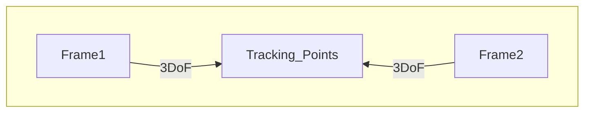
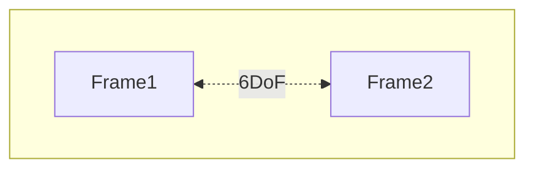

# Sensor Fusion

#sensor #calibration #HMD
## Kalman Filter

### Definition

Mathematical Approach to iteratively predict the next Step within a defined System
→ Dynamic Process Modelling, for next step prediction from current recorded system

### Problem 
→ 6 DoF Tracking of an object (HMD - VR Headset)

1. Define Representations for Pose of Object ("Which parameters should we estimate?") 
	1. Orientation
	2. Position
2. Define Motion Model (→ combined time pose update function)
3. Update Measurements in Model
4. Predict and Repeat

## Calibration and Registration

### Absolute Orientation

1. Set Up two systems that track an Object in a 2D Space (3DoF) from different perspectives
	  → through the combination of data you can derive the relationship between both coordinate frames (Frame could be a fixed Camera, so 2D Image of 3D Scene)

2. We can now derive the relation between Frame1 and Frame2

### Applications
- this idea can be used for 3D-3D-Pose Estimation
- have an ART Tracker that tracks a HMD as well as a model with tracking points
- we can now estimate the poses and overlay a virtual scene fittingly as we know the relation between our scene points and HMD
	  → Overlay a 3D Model onto a defined tracking space

## Hand-Eye Calibration

1. Have an Object with ie.: Mechanical Movement so we can **measure** its exact orientation
2. Have a Camera attached to this object that tracks an AR Marker
3. We can now derive the spacial relationship between robot and marker from different positions

→ Idea is basically to move the robot, we know the mechanical movements relation to the robot as well as the relation from the camera to the marker
→ we can derive the relations of the robot to the marker as well as the actual location in 3d space by moving the robot

